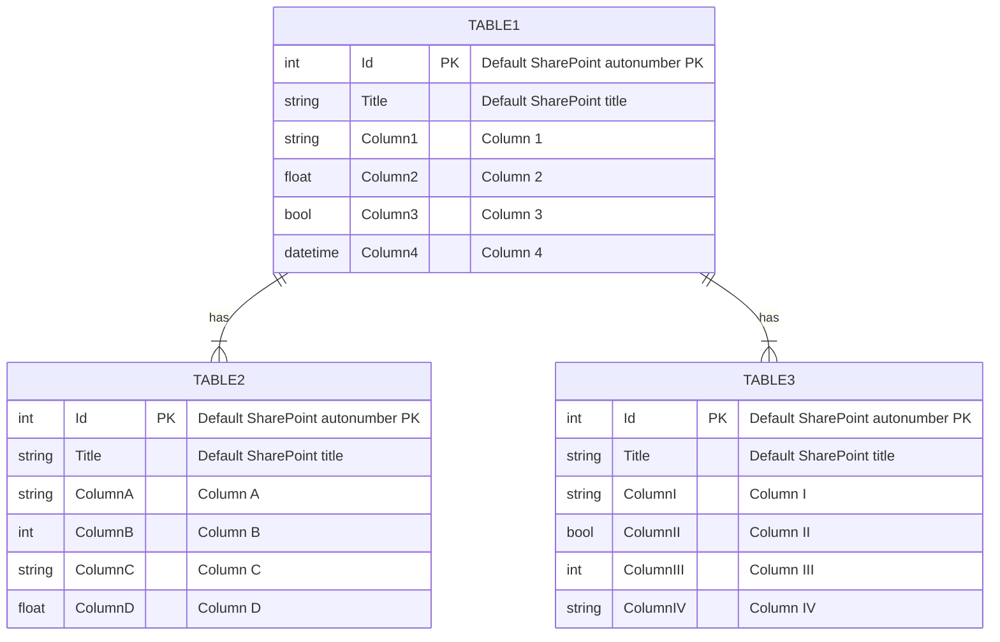
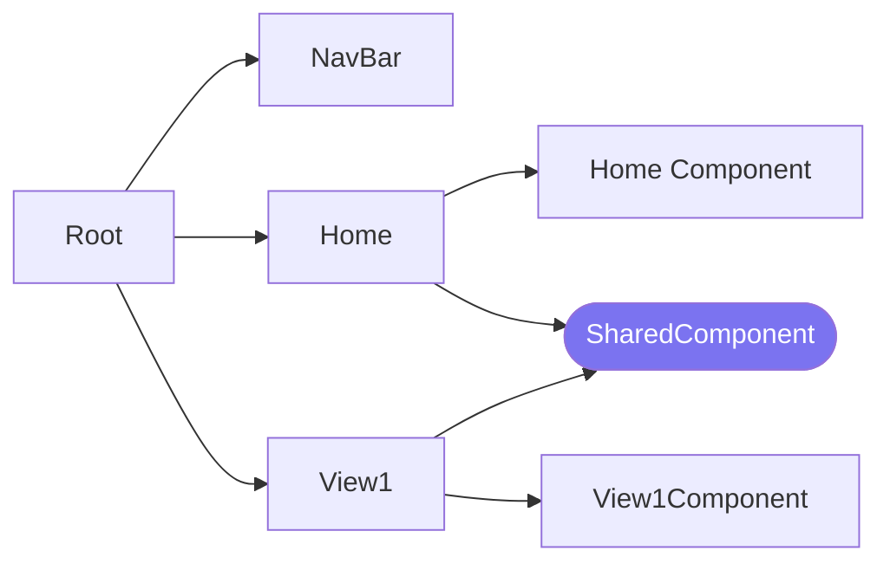
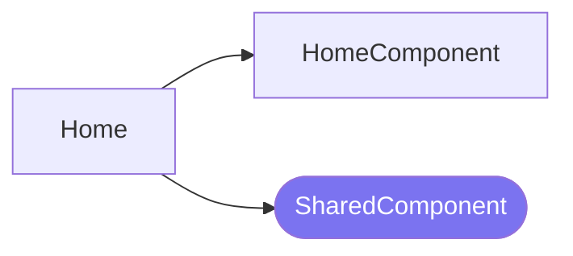
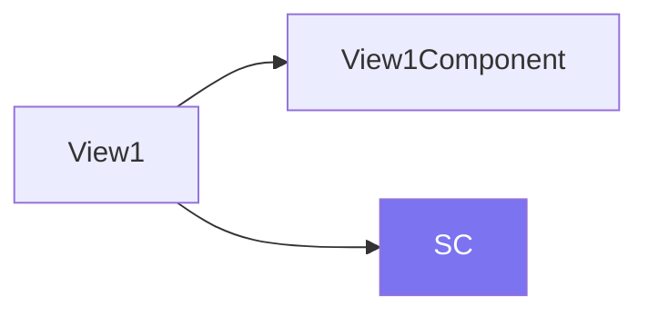

# Developer Guide
This README contains details on <Your App's> current implementation.

### Table of Contents
> Insert TOC here.

## Data
> Amend ERD below. Add descriptions to help other developers understand what data you're working with.

## Main Libraries

> The libraries below are included in `package.json`. Add on other libraries that you will be using.

| Library | Purpose |
| :------ | :------ |
| react | Frontend library |
| react-router-dom | For routing as an SPA |
| react-query | State management and querying |
| axios | HTTP requests |
| jquery | DOM manipulation |
| validator | Form validation |
| slugify | Shortening text to safe form |
| react-icons | Icons |
| craco | Custom build to single bundle |

## Security Checklist for React Frontend (Provisional)

| S/N | Category | Item | Check |
| :-: | :------- | :--- | :---- |
|  1  | Input Validation | Use [Validator.js](https://github.com/validatorjs/validator.js) to validate all form inputs. |  |
|  2  | Input Validation | Tell the user what is wrong as part of post-validation. |  |
|  3  | Input Validation | If you must accept URLs from the user, validate it using the HTTP or HTTPS protocols. |  |
|  4  | Output Encoding | Avoid `dangerouslySetInnerHTML` as far as possible. If you must use it, sanitise the inputs using `dompurify` first. |  |
|  5  | Output Encoding | Use default data binding (`{}`) instead of rendering or using user-supplied attributes directly in HTML tags with injectable attributes. |  |
|  6  | Access Control | Assign the minimum SharePoint permissions for users to perform their tasks. |  |
|  7  | Data Protection | Remove sensitive data from SharePoint once no longer required. |  |
|  8  | System Configuration | Manage and record all changes to the source code via GitHub. |  |
|  9  | File Management | If files must be uploaded, (1) validate them and (2) store them in a Document Library separate from the app's document library. |  |
| 10  | General Coding Practices | Limit the developer team (GitHub collaborators) to approved developers only. |  |
| 11  | General Coding Practices | Use Snyk.io to scan the repo for vulnerabilities. |  |
| 12  | General Coding Practices | Use SonarLint for code smells. |  |

## Architecture
The `src` directory is set up to mimic the component dependency tree as closely as possible. Top-level components are in folders in TitleCase, while folders for all other supporting elements are in lowercase.

In the diagrams below, each folder contains `index.js`, and sometimes, also `styles.css`. We omit these files from the diagram for simplicity. Cells in purple are shared components.

### Top-Level Components

#### 1. `NavBar`
Navigation bar with the following links:

- Home

> Add more links as required.

#### 2. `Home`
> Insert description of this component and update the flowchart below.

| Component | Purpose |
| :-------- | :------ |
| `Home` | Contains an overall `ProgressCard` [shared component](#components), and one small `ProgressCard` within a card per non-HQ team. |
| `Home1Component` | *Description of component* |

#### 3. `View1`
> Insert description of this component and update the flowchart below.

| Component | Purpose |
| :-------- | :------ |
| `View1` | Contains three Tab panels, one for each frequency (monthly, quarterly, annual). Each panel contains a `TeamPane`. Queries the team's Objectives, KRs, and Updates and passes it into each (Bootstrap) Tab panel. |
| `View1Component` | *Description of component* |

### `shared` Entities
This folder comprises components that are shared across 2 or more components. Any reference to another component will always go to the `shared` folder.

#### Components

| Component | Purpose |
| :-------- | :------ |
| `SharedComponent` | *Description of component* |

#### Hooks
Data is retrieved and managed using [React Query](https://react-query-v3.tanstack.com/overview).

| Hook(s) | Usage |
| :------ | :---- |
| Example: `useObjectives`, `useKeyResults`, `useUpdates` | Retrieve all data for `Home`. |

> Describe each type of custom React Query hook separately. State any dependenciecs between them. An example is provided below:

##### 1. `useObjectives`
For retrieving Objectives. There are multiple hooks:

- `useObjectives()`: Retrieves **all** Objectives in the database. It has several dependant hooks:
    - `useObjective(Id)`: Retrieves Objective with a given Id using data from `useObjectives`.
    - `useTeamObjectivesCache(team)`: Retrieves Objectives under a given team using data from `useObjectives`.
- `useObjectivesByFreq(freq)`: Retrieves Objectives with a given frequency only.
- `useTeamObjectives(team)`: Retrieves Objectives under a given team only.

##### 4. `useToken`
For getting X-RequestDigest for SharePoint POST requests. Has a single `useToken` hook.

##### Other Information
> Any other pertinent information you need developers to know. E.g. React Query settings.

#### Utils

| Function | Usage |
| :------ | :---- |
| `utilFunction` | *Description of function* |
